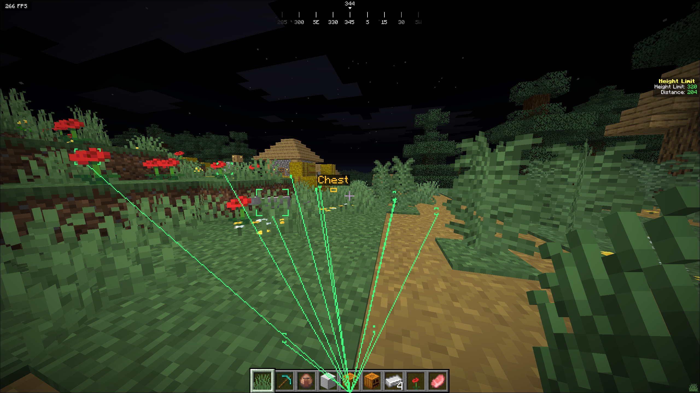
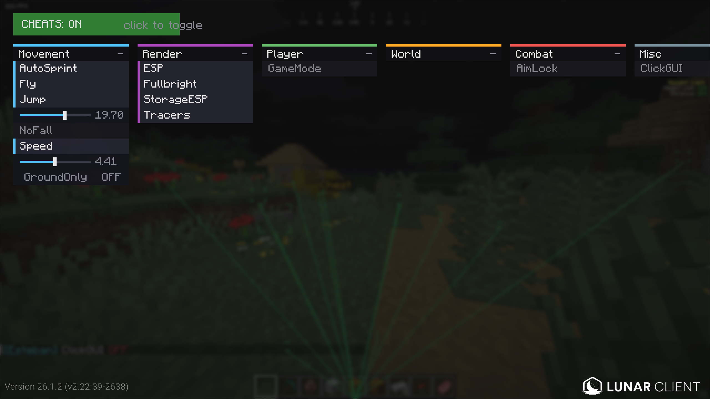
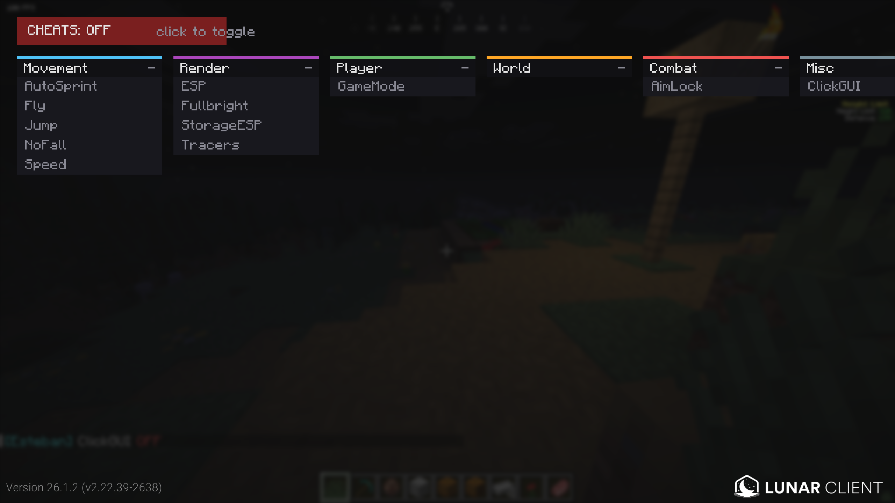

# esteban

fabric utility client for minecraft 26.x. fly, speed, a jump that actually goes the exact height u set, aim lock that auto hits, esp, tracers, and storage esp so u can see every chest shulker and spawner around u thru walls

works on windows and linux (mac too prolly, its just java)

heads up tho, most servers ban stuff like this and anticheats catch movement hacks fast. use it in singleplayer, ur own server, or wherever its allowed. if u get banned thats on u

## screenshots

storage esp on a village chest, esp boxes + tracers on every mob



the menu, armed with jump and speed settings open



and when its off, nothing runs till u click that red box



## versions

grab the jar for ur exact version from [releases](https://github.com/SunqdXX/esteban/releases)

| minecraft | jar |
|---|---|
| 26.3 | `esteban-1.1.0+26.3.jar` |
| 26.2 | `esteban-1.1.0+26.2.jar` |
| 26.1.2 | `esteban-1.1.0+26.1.2.jar` |
| 26.1 | `esteban-1.1.0+26.1.jar` |

wrong jar wont load, fabric just tells u its the wrong version before the game even starts

## install

u need 3 things, all for the same mc version: fabric loader, fabric api, and the esteban jar

**prism / multimc / modrinth app / curseforge**

make a fabric instance for ur version, add fabric api from the mod browser, drop the esteban jar in that instance's `mods` folder. done

**vanilla launcher**

run the [fabric installer](https://fabricmc.net/use/installer/) for ur version, grab [fabric api](https://modrinth.com/mod/fabric-api), then put both jars in ur mods folder:

- windows: `%APPDATA%\.minecraft\mods` (just paste that in the file explorer bar)
- linux: `~/.minecraft/mods`

then start the fabric profile

**lunar client**

pick ur version and set the loader to fabric, then put fabric api + esteban in:

- windows: `%USERPROFILE%\.lunarclient\profiles\26\mods\fabric-<version>`
- linux: `~/.lunarclient/profiles/26/mods/fabric-<version>`

runs fine next to sodium and iris btw

## how to use

- **backspace** opens the menu
- everything starts off every time u launch, click `CHEATS: OFF` top left to arm it. click it again and everything shuts off at once
- left click a module to turn it on/off
- with AimLock on, **middle click** a mob or player to lock onto it. middle click it again (or middle click nothing) to let go
- right click a module to open its settings, click the switches, drag the sliders
- drag a panel by its header to move it, right click the header to fold it

settings save to `esteban/esteban.txt` in ur game folder. which modules were on dosent get saved, thats on purpose so u always start clean

## modules

| module | what it does | settings |
|---|---|---|
| Fly | lets u fly | `Mode` (Motion, Vanilla, TP), `Speed`, `Hover` |
| Speed | go faster | `Speed`, `GroundOnly` |
| Jump | jumps to the exact height u set, in blocks. sprint jumping and holding space to bhop still work normal | `Height` (1.5 to 30) |
| AimLock | middle click a mob or player and ur aim locks on and follows it smooth. the second ur attack bar is full and its in ur normal reach it hits, then waits for the bar to fill back up and hits again. only hits when ur crosshair is actually on it so no hitting thru walls, and it lets go when the target dies or gets too far | `Speed`, `LockRange`, `AutoHit` |
| NoFall | no fall damage, turn this on if ur doing big jumps | |
| AutoSprint | always sprinting | |
| Fullbright | see in the dark | |
| ESP | boxes on players (red) and mobs (green) thru walls | `Range`, `PlayersOnly`, `Corners` |
| Tracers | lines from the bottom of ur screen to every player and mob | `Range` |
| StorageESP | boxes + name tags on every chest, trapped chest, ender chest, shulker, barrel, hopper, dropper, dispenser and spawner in range, thru walls. blocks stay solid, its just drawn on top | `Range`, `Chests`, `Shulkers`, `Barrels`, `Droppers`, `Spawners`, `Names`, `Tracers` |
| GameMode | sends `/gamemode`, only works if ur op | `Mode` |

storage colors: chests gold, ender chests teal, shulkers purple, barrels tan, hoppers droppers and dispensers grey, spawners red

## build it urself

u just need java 17 or newer installed. gradle grabs everything else by itself, even jdk 25 and the minecraft files

linux:

```
./gradlew build -Pmc=26.3
```

windows (powershell, keep the quotes, powershell gets weird with the dot):

```
.\gradlew.bat build "-Pmc=26.3"
```

jar ends up in `build/libs/`. swap 26.3 for whatever version u want

it pulls the minecraft client and its libs straight from mojang and checks every file against mojangs own checksums, nothing from minecraft is stored in this repo

26.x has no obfuscation so theres no mappings and no mixins, just fabric api's tick and hud hooks. mojang renamed some stuff between versions (and 26.3 ditched glfw for sdl3) so the small classes in `src/platform/` handle that

## license

[GPL-3.0](LICENSE)
