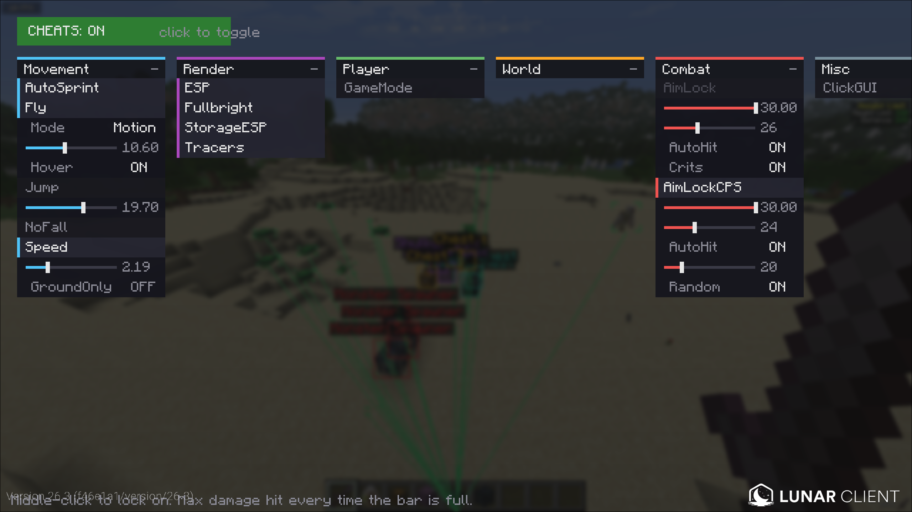
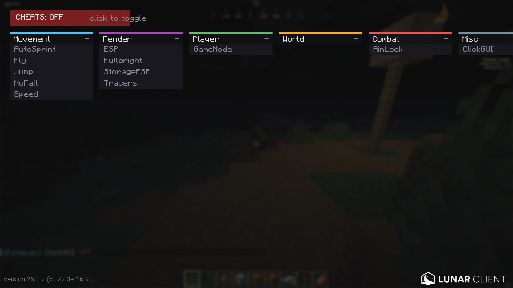

# esteban

fabric utility client for minecraft 26.x, plus a 1.21.4 build for 2b2t and other anarchy servers. fly, speed, jesus, a jump that actually goes the exact height u set, aim lock that auto hits (full charge or cps spam), hitboxes, auto totem, fast place n fast break, anti afk kick, esp, tracers, and storage esp so u can see every chest shulker and spawner around u thru walls

works on windows and linux (mac too prolly, its just java)

heads up tho, most servers ban stuff like this and anticheats catch movement hacks fast. use it in singleplayer, ur own server, or wherever its allowed. if u get banned thats on u

## screenshots

armed, with the combat settings open (aimlock n aimlockcps sliders)



and when its off nothing runs till u click that red box



## versions

grab the jar for ur exact version from [releases](https://github.com/SunqdXX/esteban/releases)

| minecraft | jar |
|---|---|
| 26.3 | `esteban-1.3.0+26.3.jar` |
| 26.2 | `esteban-1.3.0+26.2.jar` |
| 26.1.2 | `esteban-1.3.0+26.1.2.jar` |
| 26.1 | `esteban-1.3.0+26.1.jar` |
| 1.21.4 (2b2t) | `esteban-1.3.0+1.21.4.jar` |

wrong jar wont load, fabric just tells u its the wrong version before the game even starts

the 1.21.4 jar is the same client with every module, its there for 2b2t and the other anarchy servers still on 1.21.4. nofall, jesus, autototem and antikick are the ones u want for travel and afk

## install

u need 3 things, all for the same mc version: fabric loader, fabric api, and the esteban jar

**prism / multimc / modrinth app / curseforge**

make a fabric instance for ur version, add fabric api from the mod browser, drop the esteban jar in that instance's `mods` folder. done

**vanilla launcher**

run the [fabric installer](https://fabricmc.net/use/installer/) for ur version, grab [fabric api](https://modrinth.com/mod/fabric-api), then put both jars in ur mods folder:

- windows: `%APPDATA%\.minecraft\mods` (just paste that in the file explorer bar)
- linux: `~/.minecraft/mods`

then start the fabric profile

**lunar client**

pick ur version and set the loader to fabric, then put fabric api + esteban in:

- windows: `%USERPROFILE%\.lunarclient\profiles\26\mods\fabric-<version>`
- linux: `~/.lunarclient/profiles/26/mods/fabric-<version>`

for 1.21.4 its `profiles\1.21\mods\fabric-1.21.4` instead

runs fine next to sodium and iris btw

## how to use

- **backspace** opens the menu (u can change that key too, its the ClickGUI row in Misc)
- everything starts off every time u launch, click `CHEATS: OFF` top left to arm it. click it again and everything shuts off at once
- left click a module to turn it on/off
- **middle click a module to give it a hotkey**, then press whatever key u want. esc cancels, backspace or delete removes it. the key shows up on the right side of the module
- middle click the `CHEATS` box to give the master switch its own hotkey, so u can arm everything without opening the menu
- hotkeys work in game while cheats are armed, never while ur typing in chat. the bar above ur hotbar tells u what u just turned on or off
- with AimLock or AimLockCPS on, **middle click** a mob or player in game to lock onto it. middle click it again (or middle click nothing) to let go. only one of them can be on at a time, the other one goes dark in the menu
- right click a module to open its settings, click the switches, drag the sliders
- drag a panel by its header to move it, scroll over a long panel to slide it, right click the header to fold it

settings and hotkeys save to `esteban/esteban.txt` in ur game folder. which modules were on dosent get saved, thats on purpose so u always start clean

## modules

| module | what it does | settings |
|---|---|---|
| Fly | lets u fly | `Mode` (Motion, Vanilla, TP), `Speed`, `Hover` |
| Speed | go faster | `Speed`, `GroundOnly` |
| Jump | jumps to the exact height u set, in blocks. sprint jumping and holding space to bhop still work normal | `Height` (1.5 to 30) |
| AimLock | middle click a mob or player and ur aim locks on and follows it smooth. when ur attack bar is full and its in ur normal reach it hits, waits for the bar to fill back up, hits again. every hit is full charge even with a bit of lag, fist sword axe whatever. with `Crits` on, jump and it hits on the way down for crits, even while sprinting. only hits when ur crosshair is on it so no hitting thru walls, lets go when the target dies or gets too far | `Speed`, `LockRange`, `AutoHit`, `Crits` |
| AutoTotem | keeps a totem in ur offhand. when one pops the next one goes in right away, even with a chest open. shows how many u got left | `Delay` |
| Hitboxes | makes player and mob hitboxes bigger so ur hits land easier, aimlock uses it too | `Expand`, `PlayersOnly` |
| AimLockCPS | same lock, but when theyre in reach it spams hits like an autoclicker, up to 100 cps. `Random` makes it a bit uneven so it looks human. best on bedwars type servers with no attack cooldown, on normal 26.x servers AimLock kills faster cuz spam hits are weaker | `Speed`, `LockRange`, `AutoHit`, `CPS` (1 to 100), `Random` |
| NoFall | no fall damage from any height, turn this on if ur doing big jumps | |
| Jesus | walk, sprint and ride on water and lava like its solid ground. sneak to sink. if u fall from high up into water it lets u dive in so u take no fall damage, then pops u back on top. on 1.21.4 lava dont even burn u. on 26.x the server runs its own copy of ur movement so lava still burns there, drink fire res first and ur good | `Lava`, `Vehicles` |
| AutoSprint | always sprinting | |
| Fullbright | see in the dark | |
| ESP | boxes on players (red) and mobs (green) thru walls | `Range`, `PlayersOnly`, `Corners` |
| Tracers | lines from the bottom of ur screen to every player and mob | `Range` |
| StorageESP | boxes + name tags on every chest, trapped chest, ender chest, shulker, barrel, hopper, dropper, dispenser and spawner in range, thru walls. blocks stay solid, its just drawn on top | `Range`, `Chests`, `Shulkers`, `Barrels`, `Droppers`, `Spawners`, `Names`, `Tracers` |
| FastPlace | no cooldown on right click, places blocks and throws stuff every tick instead of every 4 | `Delay` |
| FastBreak | no cooldown between breaking blocks. `Boost` finishes every block at 70%, thats as early as a normal server accepts so no ghost blocks | `Boost` |
| AntiKick | when ur afk it does tiny moves every few secs so the server never kicks u for idling. stops the second u touch anything | `Interval`, `Step` |
| GameMode | sends `/gamemode`, only works if ur op | `Mode` |

storage colors: chests gold, ender chests teal, shulkers purple, barrels tan, hoppers droppers and dispensers grey, spawners red

## build it urself

u just need java 17 or newer installed. gradle grabs everything else by itself, even jdk 25 and the minecraft files

linux:

```
./gradlew build -Pmc=26.3
```

windows (powershell, keep the quotes, powershell gets weird with the dot):

```
.\gradlew.bat build "-Pmc=26.3"
```

jar ends up in `hacks/build/libs/` (`esteban-<version>+<mc>.jar`). swap 26.3 for whatever version u want

it pulls the minecraft client and its libs straight from mojang and checks every file against mojangs own checksums, nothing from minecraft is stored in this repo

26.x has no obfuscation so it builds straight against mojangs own names, no mappings. 1.21.4 is still obfuscated so that one goes thru fabric loom with mojang mappings (`-Pmc=1.21.4`, it wants jdk 21 and gradle grabs that too). a few tiny mixins hook what fabric api cant (water collision for jesus, the crosshair for hitboxes, the place n break cooldowns). mojang renamed stuff between versions (and 26.3 ditched glfw for sdl3) so the small classes in `src/platform/` and `src/glue/` handle that

the repo is 3 gradle projects:

- `hacks` is this client
- `common` is the shared stuff (key hooks, drawing, menus), zero cheats in it. it gets packed inside the jar so u still only drop in one file
- `hud` is a separate jar with no cheats at all, for servers where hacks get u banned. so far it shows fps, cps, coords, ping and keystrokes (wasd, both mouse buttons with their cps, space) in the top left. toggle sprint is off by default. turn it on and it flips minecrafts own sprint setting to toggle (the same one in controls) and shows when ur sprinting, turn it off and ur old setting comes back. more modules and a drag editor are coming. its settings save to `config/esteban-hud.json`

`build` also runs `checkHudClean`, which fails if the hud jar (or the common jar inside it) could ever reach any hacks code

## license

[GPL-3.0](LICENSE)
